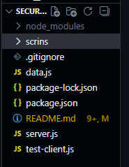
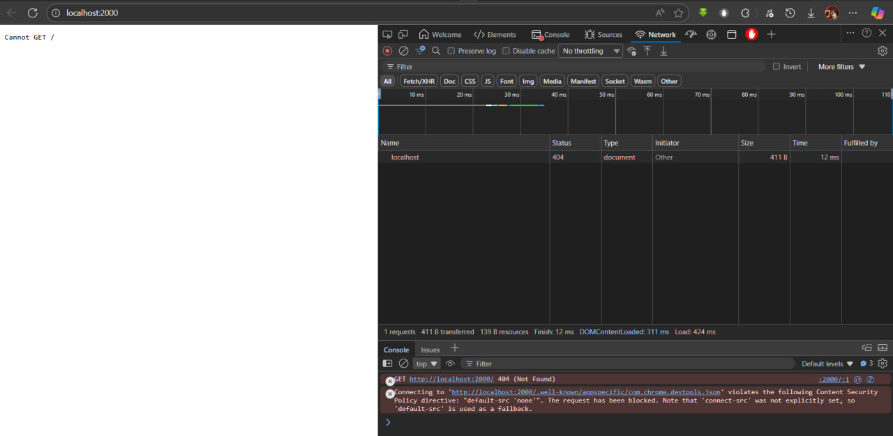
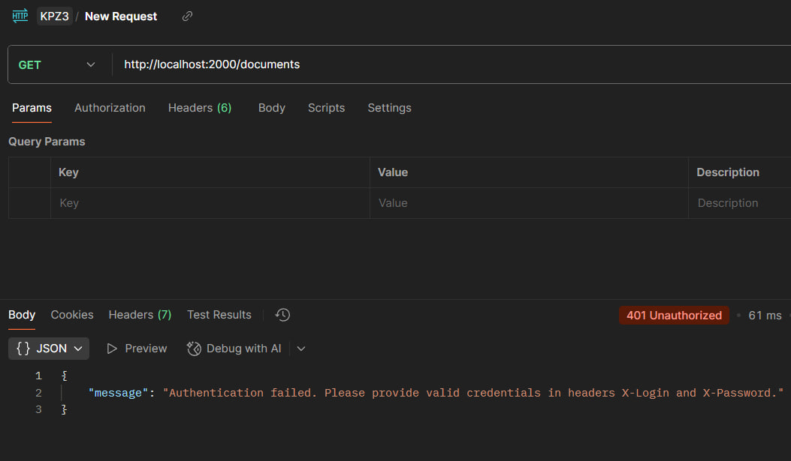
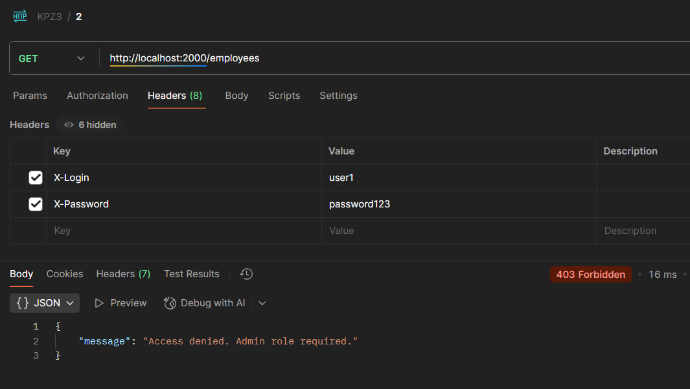
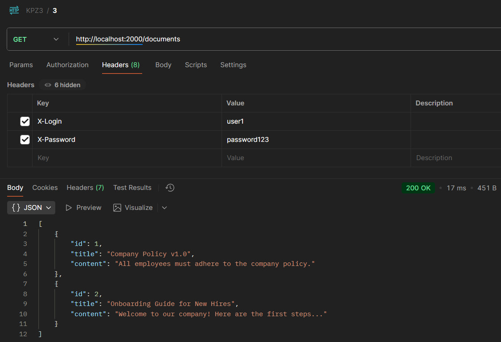
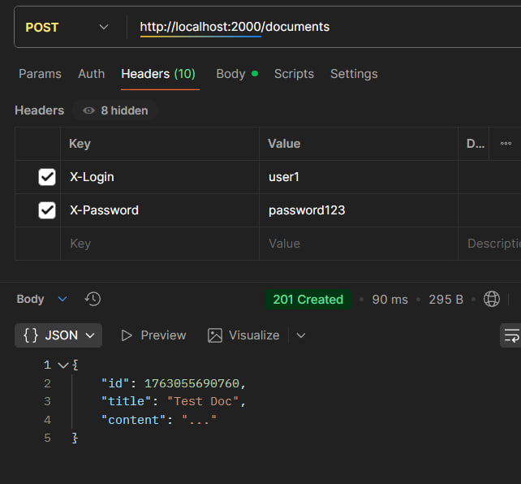
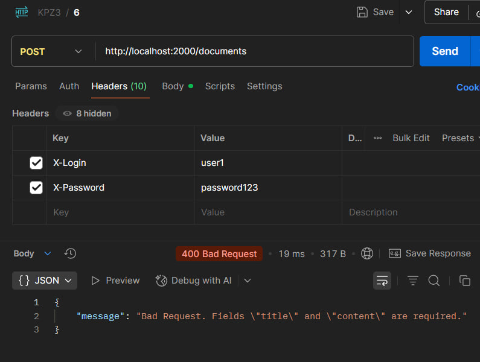
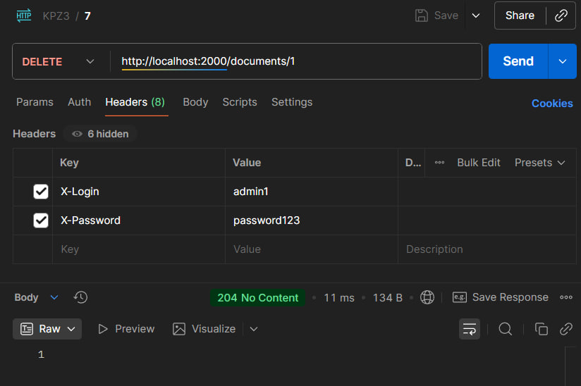
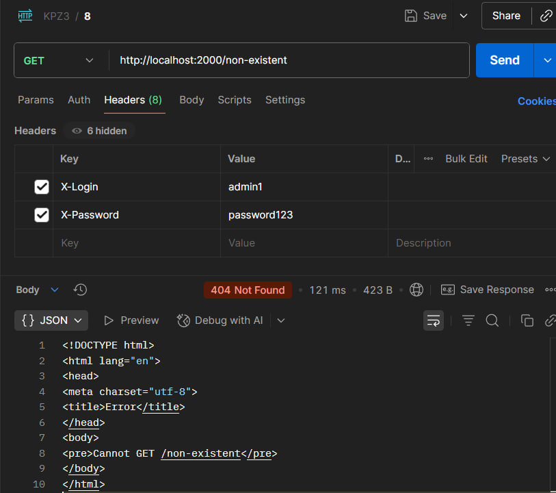
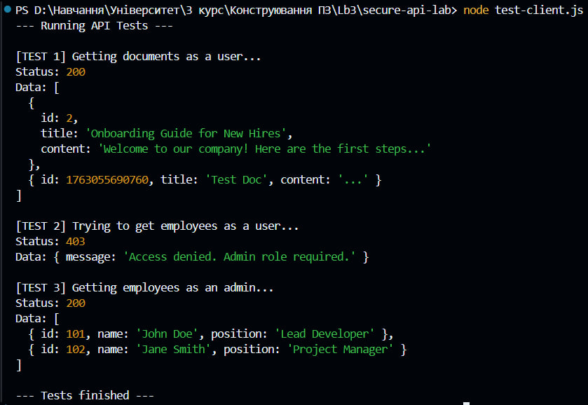

# secure-api-lab
## Лабораторна робота №3: Розробка та тестування захищеного REST API на Node.js та Express

### Дисципліна: Конструювання ПЗ
### Виконав: *Биков Віктор з групи ІПЗ 3.03*
---
## Опис проекту
Цей проект є лабораторною роботою, спрямованою на розробку та тестування захищеного REST API за допомогою Node.js та Express. Метою є створення безпечного API, який забезпечує автентифікацію, авторизацію та захист від поширених вразливостей.

## Інструкція зі встановлення та запуску

Встановлення залежностей
```bash
npm install
```

### Запуск сервера
```bash
npm start
```
Після запуску сервер доступний за адресою:  
👉 http://localhost:2000

### Запуск тестового клієнта
(Сервер має бути запущений!)
```bash
npm test
```

---
## Структура проекту
```
WORKSHOP_3_SECURE-API-LAB/
├─ scrins/...
├─ data.js
├─ server.js
├─ test-client.js
├─ package.json
└─ README.md
```

## Скріншот структури



---
## Реалізовані ендпоінти

| HTTP Метод | URL | Опис | Необхідні заголовки | Тіло запиту (JSON) | Можливі коди відповіді |
|-------------|-----|------|----------------------|----------------------|---------------------------|
| **GET** | `/documents` | Отримати всі документи | `X-Login`, `X-Password` | — | 200 OK, 401 Unauthorized |
| **POST** | `/documents` | Додати новий документ | `X-Login`, `X-Password` | `{ "title": "Text", "content": "Text" }` | 201 Created, 400 Bad Request, 401 Unauthorized |
| **DELETE** | `/documents/:id` | Видалити документ за ID | `X-Login`, `X-Password` | — | 204 No Content, 401 Unauthorized, 404 Not Found |
| **GET** | `/employees` | Отримати список співробітників | `X-Login`, `X-Password` (роль `admin`) | — | 200 OK, 401 Unauthorized, 403 Forbidden |

---

## HTTP-коди, що підтримуються сервером

| Код | Значення | Коли використовується |
|------|-----------|-----------------------|
| **200 OK** | Запит виконано успішно | GET /documents, GET /employees |
| **201 Created** | Створено новий ресурс | POST /documents |
| **204 No Content** | Видалення виконано | DELETE /documents/:id |
| **400 Bad Request** | Невірні дані у запиті | Відсутній title або content |
| **401 Unauthorized** | Неавторизований користувач | Немає або некоректні X-Login / X-Password |
| **403 Forbidden** | Немає прав доступу | Користувач без ролі admin звертається до /employees |
| **404 Not Found** | Ресурс не знайдено | Видалення неіснуючого документа |

---

## Демонстрація роботи через тестування

**Тестування з рядка браузеру :**



**Тестування через Postman :**

*GET /documents*



*GET /employees (`X-Login: user1` ,`X-Password: password123`)*



*GET /documents (`X-Login: user1` ,`X-Password: password123`)*



*GET /employees (`X-Login: admin1` ,`X-Password: password123`)*


*POST /documents (`X-Login: user1` ,`X-Password: password123`) (`{ "title": "Test Doc", "content": "..." }`)*




*POST /documents (`X-Login: user1` ,`X-Password: password123`) (`{ "content": "..." }`)*



*DELETE /documents/1 (`X-Login: admin1` ,`X-Password: password123`)*



*GET /non-existend (`X-Login: admin1` ,`X-Password: password123`)*



**Тестування через NODE-скрипт :**

*Скрипт:*
```javascript
// Адреса вашого локального сервера

const BASE_URL = 'http://localhost:2000';

// Дані для аутентифікації
const userCredentials = {
  'X-Login': 'user1',
  'X-Password': 'password123',
};

const adminCredentials = {
  'X-Login': 'admin1',
  'X-Password': 'password123',
};

// Функція для тестування
const runTests = async () => {
  console.log('--- Running API Tests ---');
  // Сценарій 1: Успішний запит від імені користувача
  console.log('\n[TEST 1] Getting documents as a user...');

  try {
    const response = await fetch(`${BASE_URL}/documents`, {
      method: 'GET',
      headers: userCredentials,
    });

    const data = await response.json();

    console.log('Status:', response.status);
    console.log('Data:', data);
  } catch (error) {
    console.error('Error:', error.message);
  }

  // Сценарій 2: Спроба доступу до адмін-ресурсу від імені користувача
  console.log('\n[TEST 2] Trying to get employees as a user...');

  try {
    const response = await fetch(`${BASE_URL}/employees`, {
      method: 'GET',
      headers: userCredentials,
    });

    const data = await response.json();
    console.log('Status:', response.status); // Очікуємо 403
    console.log('Data:', data);
  } catch (error) {
    console.error('Error:', error.message);
  }

  // Сценарій 3: Успішний запит від імені адміністратора

  console.log('\n[TEST 3] Getting employees as an admin...');

  try {
    const response = await fetch(`${BASE_URL}/employees`, {
      method: 'GET',
      headers: adminCredentials,
    });

    const data = await response.json();
    console.log('Status:', response.status);

    console.log('Data:', data);
  } catch (error) {
    console.error('Error:', error.message);
  }

  console.log('\n--- Tests finished ---');
};

runTests();
```

*Результат виконання тестового скрипту :*



---